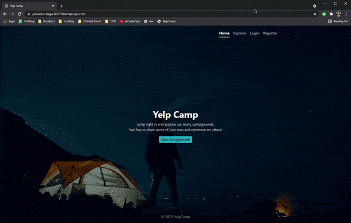

# Yelp Camp

## Description

<kbd></kbd>

Yelp style web app that allows users to view campgrounds across the country. Implements restful API's with full CRUD functionality. Also incorporates user authorization/authentication, cloud based image management, dynamic mapping & standard security best practices.

[Link to deployed app](https://peaceful-taiga-60279.herokuapp.com/)

## Origin
This is the capstone project for "[The Web Developer Bootcamp 2021](https://www.udemy.com/course/the-web-developer-bootcamp/)". While I wrote all of the code in this repository, it was from following along with the class material.

## Tech Stack
* <ins>Authentication middleware</ins> - Passport.js
* <ins>Backend runtime environment</ins> - Node.js 
* <ins>Backend framework</ins> - Express
* <ins>Cloud app platform</ins> - Heroku
* <ins>Database</ins> - MongoDB
* <ins>Embedded templating</ins> - EJS
* <ins>Frontend framework</ins> - Bootstrap
* <ins>Mapping</ins> - Mapbox
* <ins>Media management</ins> - Cloudinary
* <ins>Object modeling</ins> - mongoose
